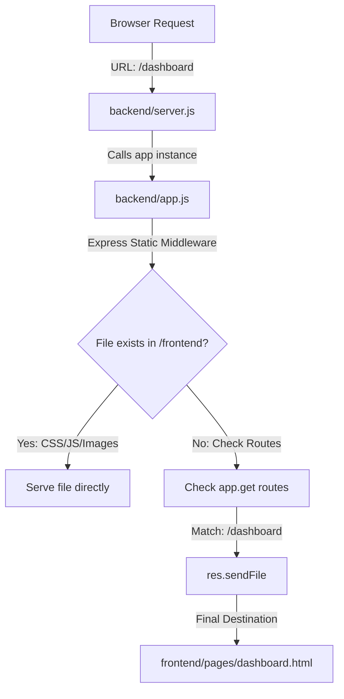

# Server Request Flow & Linking Map

This document visualizes how a request flows through the Node.js server to eventually serve your HTML pages and API data.

## 📥 1. Page Request Flow (Serving HTML)
When a user types `localhost:5000/dashboard` in their browser, this is the path the request takes:



---

## ⚙️ 2. API Request Flow (Serving Data)
When a page needs data (like fetching products), it calls the API. Here is how those files are linked:

```text
[ Browser / JS Fetch ]
       │
       ▼
 [ backend/server.js ] ──► (Starts the listener)
       │
       ▼
 [ backend/app.js ] ───► (Registers Route Groups)
       │
       ├─ app.use('/api/auth', ...) ───► [ routes/authRoutes.js ]
       ├─ app.use('/api/products', ...) ── [ routes/productRoutes.js ]
       └─ app.use('/api/admin', ...) ─── [ routes/adminRoutes.js ]
                                                │
                                                ▼
                                    [ handlers/(Specific)Handler.js ]
                                        (Contains Logic)
                                                │
                                                ▼
                                    [ config/jsonDb.js ]
                                        (DB Engine)
                                                │
                                                ▼
                                    [ data/(Specific).json ]
                                        (Physical Data)
```

---

## 🔗 3. Direct File-to-File Relationship

| Starting File | Links To / Calls | Purpose |
| :--- | :--- | :--- |
| **server.js** | `app.js` | To initialize the Express application. |

| **app.js** | `routes/*.js` | To delegate API requests to specific route files. |

| **app.js** | `frontend/pages/*.html` | To serve the actual web pages to the user. |

| **routes/*.js** | `handlers/*.js` | To connect a URL (e.g., `/login`) to a logic function. |

| **handlers/*.js** | `config/jsonDb.js` | To request data from the local JSON storage. |

| **jsonDb.js** | `data/*.json` | To physically read/write the .json files on disk. |

---

## 🗺️ 4. The "Path of Discovery"
- **Entry Point**: `backend/server.js`
- **Routing Hub**: `backend/app.js`
- **Logic Center**: `backend/handlers/`
- **Data Source**: `data/`
- **Display Layer**: `frontend/pages/`
