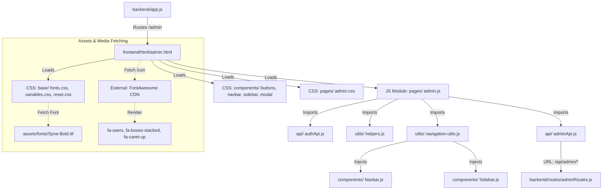

# Linking Map: Admin Panel (admin.html)

This document visualizes the complete dependency chain for the **Platform Administration Console**, from the server entry point down to the specific assets fetched from the folders.

## 🏗️ 1. File Structure & Asset Flow

---

## 📂 2. Detailed Dependency Breakdown

### 🎨 Styling & Design System
*   **Base Styles**: Loaded from `frontend/css/base/`. Sets the root HSL variables used for the "Dark Theme" aesthetics.
*   **Admin-Specific CSS (`admin.css`)**: Implements the unique "Glassmorphism" effect for stat cards and the sidebar layout that differs from the main site.
*   **Modal Styling**: The `modal.css` is crucial here for the **Rejection/Approval** confirmation popups.

### 🧠 JavaScript Execution & API Linking
1.  **`admin.js`**:
    *   **Security Barrier**: Immediately checks `localStorage` for `userInfo`. If `role !== 'admin'`, it forces a redirection to `/dashboard`.
    *   **Live Dashboard**: Uses `animateCounter()` to pull live numbers from the server and "count up" the student and listing totals.
    *   **Moderation Engine**: Links the "Approve" and "Reject" buttons directly to the `handleApprove` function which calls the backend API.
2.  **`adminApi.js`**: The bridge to the server. 
    *   Handles the `Authorization: Bearer <token>` header for all system-wide data requests.

### 🧱 Injected Components
*   **Dynamic Navbar**: Initialized via `initNavigation()` to ensure the admin sees their own profile avatar in the top-right.
*   **Internal Navigation**: Uses a separate `.sb-link` system defined inside `admin.html` to switch between panels (Dashboard, Analytics, Users) without reloading the page.

---

## 🖼️ 3. Asset & Media Fetching
*   **Fonts**: Heads use **Syne** (fetched from `frontend/assets/fonts/`) for a "modern tech" feel. Body text uses **Figtree**.
*   **Icons**:
    *   **UI Icons**: Fetched via the FontAwesome CDN for sidebar navigation.
    *   **Entity Icons**: Uses native Emojis (📦, 📚) as lightweight, zero-load "images" for listing items in the moderation queue.
*   **Branding**: The "N" logo icon and color-coded status badges are purely CSS-driven (found in `admin.css`) to ensure maximum loading speed for administrators.
