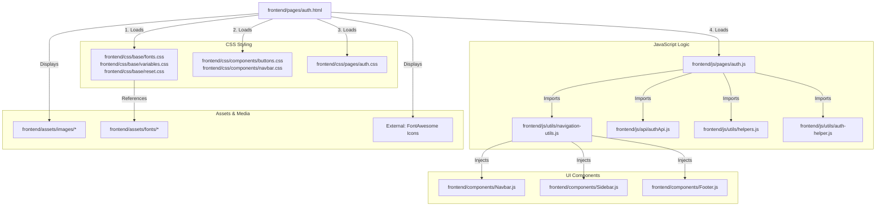

# Linking Map: Authentication Page (auth.html)

This file shows all the dependencies and connections for the **Login & Signup Page**.

## 🏗️ 1. File Structure Links

---

## 📂 2. Dependency Details

### 🎨 Stylesheets
*   **Base Styles**: Sets the foundation (Fonts, Global Variables, CSS Reset).
*   **Component Styles**: Handles the look of common elements used on Auth page (Buttons, Nav).
*   **Page Styles (`auth.css`)**: Contains the layout for the two-panel split screen (Left branding panel and Right form panel), animations for floating cards, and transition logic for multi-step signup.

### 🧠 JavaScript Execution
1.  **`auth.js`**: manages the user session and form submissions.
    *   **Login Handler**: Validates inputs and talks to `authApi.js` to log the user in.
    *   **Multi-step Signup**: Handles transition between "Account", "Profile", and "Verify" steps.
    *   **OTP Timer**: Manages the 30-second countdown for the email verification code.
2.  **`auth-helper.js`**: Reusable logic to check if a user is already signed in (redirects them if they are) and updates profile avatars in the UI.

### 🧱 Injected Components
Wait... **`auth.html` uses a custom design!** 
While it imports `navigation-utils.js`, it often overrides the default sidebar/navbar to focus the user on the login forms. However, the footer and global navigation components are still linked for fallback and redirections.

---

## 🖼️ 3. Asset Loading
*   **Fonts**: Uses Lora for headlines and Figtree for form inputs.
*   **Icons**: Extensive use of FontAwesome for input icons (Lock, Envelope, User) and the "Success" checkmarks.
*   **Dynamic UI**: The page uses "Floating Cards" that showcase recently sold items—these refer to placeholders and emojis in the code.
