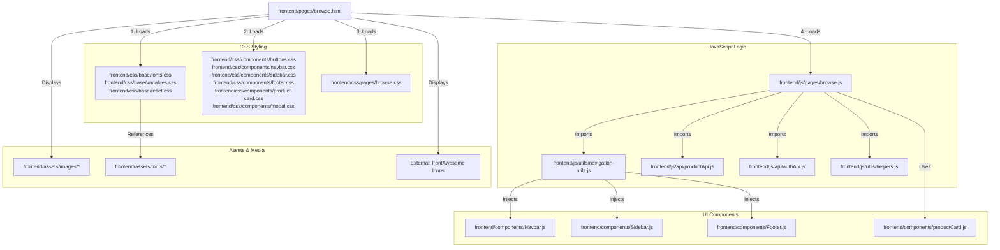

# Linking Map: Browse Page (browse.html)

This file shows all the dependencies and connections for the **Browse Marketplace Page**.

## 🏗️ 1. File Structure Links

---

## 📂 2. Dependency Details

### 🎨 Stylesheets
*   **Base Styles**: Foundation layer (Typography, HSL Color variables).
*   **Component Styles**: 
    *   `product-card.css`: Vital for layout out the search results.
    *   `modal.css`: Required for the "Quick View" item detail popup.
*   **Page Styles (`browse.css`)**: Handles the complex grid/list toggle layout and the filter sidebar.

### 🧠 JavaScript Execution
1.  **`browse.js`**: The controller for the marketplace experience.
    *   **Data Fetching**: Requests products from `productApi.js` based on URL filters.
    *   **Filtering Engine**: Handles price ranges, categories, and hostel locations.
    *   **Modal Controller**: Opens and populates the "Quick View" modal with item details and seller contact info.
    *   **View Switcher**: Toggles between `grid` and `list` layouts for items.
2.  **`productCard.js`**: Unlike the main layouts, this component is called repeatedly to generate the HTML for every single search result.

### 🧱 Injected Components
*   `Navbar.js`: Main header.
*   `Sidebar.js`: Mobile navigation drawer.
*   `Footer.js`: Bottom links.
*   `productCard.js`: The "Building Block" of the marketplace results.

---

## 🖼️ 3. Asset Loading
*   **Fonts**: Fetched locally from `assets/fonts/` (Syne for headings, Figtree/Lora for body).
*   **Icons**: Dynamic icons like Category Emojis are generated via `helpers.js`, while UI icons (Filter, x-mark) come from FontAwesome.
*   **Modal Images**: The "Quick View" modal dynamically renders large emojis or placeholder images from the asset folder.
