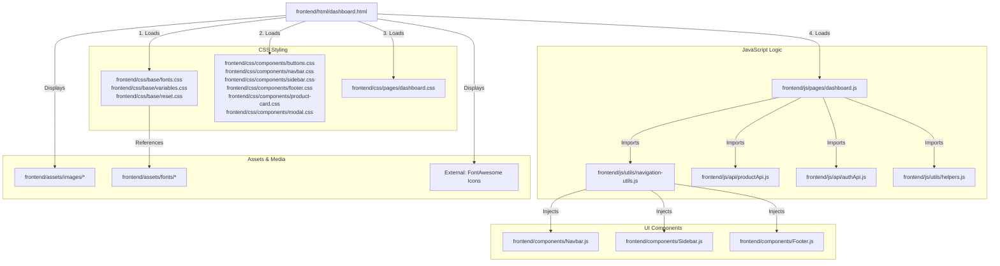

# Linking Map: Dashboard Page (dashboard.html)

This file shows all the dependencies and connections for the **User Dashboard**.

## 🏗️ 1. File Structure Links

---

## 📂 2. Dependency Details

### 🎨 Stylesheets
*   **Base Styles**: Shared typography (Figtree/Syne) and CSS variables.
*   **Component Styles**: Handles the common UI (Navbar, Modal for details) and the `product-card.css` for listing layouts.
*   **Page Styles (`dashboard.css`)**: Specific styles for the dashboard statistics cards, listing status badges (Active/Sold), and the action buttons (Mark Sold, Delete).

### 🧠 JavaScript Execution
1.  **`dashboard.js`**: The dashboard's main engine.
    *   **Auth Guard**: Immediately checks for a valid session; redirects to `/auth` if the user isn't logged in.
    *   **Data Hub**: Calls `fetchMyProducts` from `productApi.js` to get the user's specific listings.
    *   **Management Actions**: Handles interactive functions like `markAsSold` and `deleteProduct`.
    *   **UI Control**: Manages the grid/list view toggle and local sorting.
2.  **`productApi.js`**: Essential for the "Mark as Sold" and "Delete" backend communication.

### 🧱 Injected Components
*   `Navbar.js`: Standard cross-site header.
*   `Sidebar.js`: Navigation menu.
*   `Footer.js`: Bottom links.
*   **Note**: The product cards in the dashboard use a local template in `dashboard.js` rather than the external `productCard.js` component to allow for "Mark Sold" and "Delete" buttons.

---

## 🖼️ 3. Asset Loading
*   **Fonts**: Loaded from `assets/fonts/`.
*   **Icons**: FontAwesome icons for the dashboard (Plus circle for selling, Trash for deleting, Clock for time).
*   **Status Indicators**: CSS-driven color coding for Active (Green) and Sold (Red) statuses.
