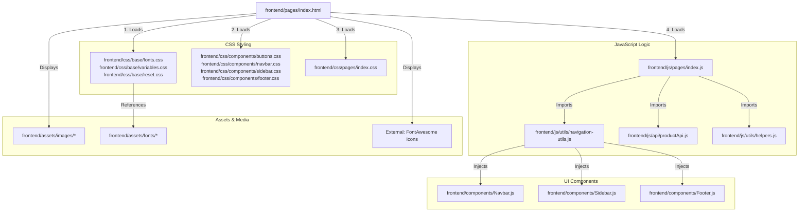

# Linking Map: Home Page (index.html)

This file shows all the dependencies and connections for the **Home Page**.

## 🏗️ 1. File Structure Links

---

## 📂 2. Dependency Details

### 🎨 Stylesheets
*   **Base Styles**: Sets the foundation (Fonts, Global Variables, CSS Reset).
*   **Component Styles**: Handles the look of common elements used on Home (Buttons, Nav, Sidebar).
*   **Page Styles (`index.css`)**: Specific styling for the Hero section, Trust & Safety cards, and CTA banners.

### 🧠 JavaScript Execution
1.  **`index.js`**: The main controller. 
    *   Triggers `initNavigation()` to build the page layout.
    *   Initializes the **Scroll Reveal** effect (making elements fade in as you scroll).
    *   Fetches public stats (total listings, etc.) from the backend.
2.  **`navigation-utils.js`**: Reusable script that picks up the pure HTML from the component files and injects it into the DOM.

### 🧱 Injected Components
Since `index.html` has empty root divs (`#navbar-root`, `#sidebar-root`), the following files provide the actual HTML:
*   `Navbar.js`: Provides the top logo and search bar.
*   `Sidebar.js`: Provides the mobile slide-out menu.
*   `Footer.js`: Provides the site map at the bottom.

---

## 🖼️ 3. Asset Loading
*   **Fonts**: Loaded via `fonts.css` from `frontend/assets/fonts/Figtree` and `Lora`.
*   **Icons**: Using FontAwesome CDN classes (e.g., `<i class="fa-solid fa-house"></i>`).
*   **Images**: Any logos or background textures reside in `frontend/assets/images/`.
