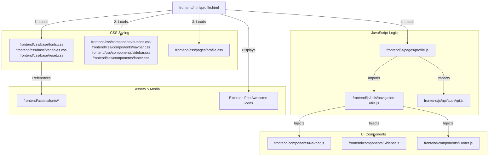

# Linking Map: Profile Page (profile.html)

This file shows all the dependencies and connections for the **My Profile Page**.

## 🏗️ 1. File Structure Links

---

## 📂 2. Dependency Details

### 🎨 Stylesheets
*   **Base Styles**: Typography and core variables.
*   **Component Styles**: Handles common UI blocks like the header and mobile navigation.
*   **Page Styles (`profile.css`)**: Contains the layout for the profile "Avatar Card" on the left and the information forms on the right. It handles the specific styling for form groups and the recent activity list.

### 🧠 JavaScript Execution
1.  **`profile.js`**: The profile management logic.
    *   **Data Population**: Fetches primary user data (Name, Email, Role) using `authApi.js` and populates the avatar circle and header.
    *   **LocalStorage Sync**: loads "Extra Fields" (Branch, Year, Phone) from `localStorage` because these are currently stored client-side for immediate display.
    *   **Save Logic**: Updates the `profileExtra` object in the browser store when the user clicks "Save Changes".
2.  **`navigation-utils.js`**: Rebuilds the global layout components.

### 🧱 Injected Components
*   `Navbar.js`: Shared header.
*   `Sidebar.js`: Mobile menu.
*   `Footer.js`: Bottom sitemap.
*   **Unique UI**: The "Avatar Circle" (`#avCircle`) is a dynamic element generated by `profile.js` taking the first letter of the student's name.

---

## 🖼️ 3. Asset Loading
*   **Fonts**: Syne for page headers, Figtree for personal details.
*   **Icons**: FontAwesome icons for data categories (User-pen, Clock-rotate-left, Tag).
*   **Storage**: Personal Preferences are stored in `localStorage.setItem('profileExtra', ...)` to persist between sessions without extra server calls.
