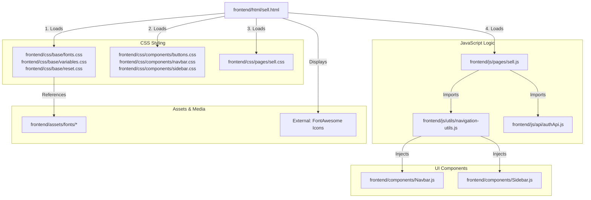

# Linking Map: Sell Page (sell.html)

This file shows all the dependencies and connections for the **Sell an Item Page**.

## 🏗️ 1. File Structure Links

---

## 📂 2. Dependency Details

### 🎨 Stylesheets
*   **Base Styles**: Shared typography (Figtree/Syne) and theme variables.
*   **Component Styles**: Handled the layout for buttons and the global responsive Navbar/Sidebar.
*   **Page Styles (`sell.css`)**: Specific styling for the submission form, including the `form-grid` layout, input focus states, and the photo upload preview box.

### 🧠 JavaScript Execution
1.  **`sell.js`**: The form controller for posting items.
    *   **Auth Check**: Immediately verifies if a user is logged in using `authApi.js`. Redirects to `/auth` if not.
    *   **Navigation Init**: Calls `initNavigation()` to build the page structure.
    *   **Form Submission**: Captures all input fields (Title, Category, Price, etc.) and sends a `POST` request to `/api/products` using the user's secure token.
    *   **Redirection**: On success, redirects the student to their **Dashboard** to see their new listing.

### 🧱 Injected Components
*   `Navbar.js`: The top navigation.
*   `Sidebar.js`: The mobile slide-out menu.
*   **Note**: This page is highly functional, focusing on the form structure. It doesn't use the `Footer.js` component to keep the interface clean and focused on the task of selling.

---

## 🖼️ 3. Asset Loading
*   **Fonts**: Loaded from `assets/fonts/`.
*   **Icons**: FontAwesome icons used for form feedback (Cloud-arrow-up for photo preview, Plus for publishing).
*   **User Data**: Fetches the logged-in student's token from `localStorage` to authorize the listing creation.
