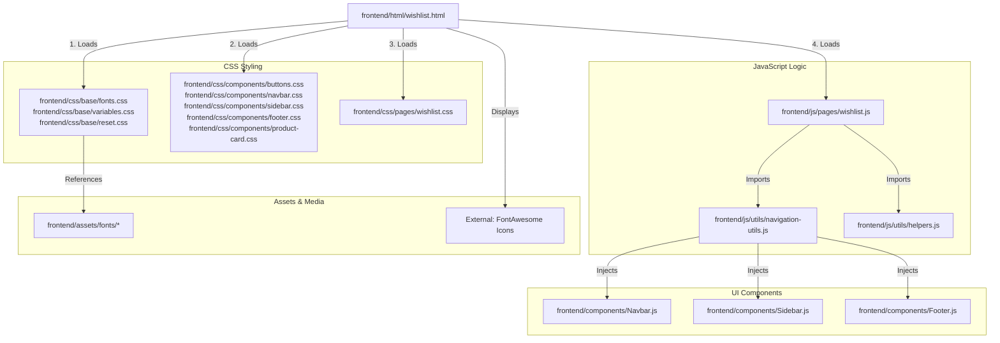

# Linking Map: Wishlist Page (wishlist.html)

This file shows all the dependencies and connections for the **User Wishlist Page**.

## 🏗️ 1. File Structure Links

---

## 📂 2. Dependency Details

### 🎨 Stylesheets
*   **Base Styles**: Variables, resets, and campus-themed fonts.
*   **Component Styles**: Global navigation and the `product-card.css` structure used for saved item "mini-cards".
*   **Page Styles (`wishlist.css`)**: Specific layout for the wishlist grid, "Clear All" toolbar, and the `empty-state` design (shown when no items are saved).

### 🧠 JavaScript Execution
1.  **`wishlist.js`**: The controller for saved items.
    *   **LocalStorage Engine**: Uses `localStorage.getItem('nitkkr_wishlist')` to retrieve items. This allows students to save items even without being logged in (stored in their browser).
    *   **Toggle Logic**: Provides `toggleWishlist(product)`—a function called from the Browse or Home page when an "Add to Wishlist" heart is clicked.
    *   **Render Engine**: Dynamically builds the "mini-card" HTML for each saved product, injecting it into `#wgrid`.
    *   **Clean-up Utility**: Functions to remove individual items or clear the entire list.
2.  **`helpers.js`**: Used to get the correct category emojis for saved items.

### 🧱 Injected Components
*   `Navbar.js`: Standard header.
*   `Sidebar.js`: Navigation menu.
*   `Footer.js`: Bottom links.
*   **Note**: Wishlist cards use a simplified version of the standard product card to focus on quick viewing and removal.

---

## 🖼️ 3. Asset Loading
*   **Fonts**: Syne and Figtree loaded from local assets.
*   **Icons**: Uses FontAwesome's solid heart (`fa-heart`) as the primary visual theme.
*   **Persistence**: Data is entirely client-side. The wishlist survives browser refreshes but is specific to the user's current browser/device.
